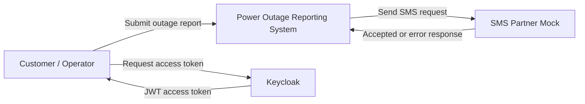
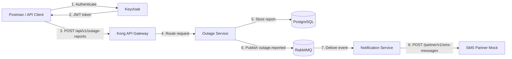
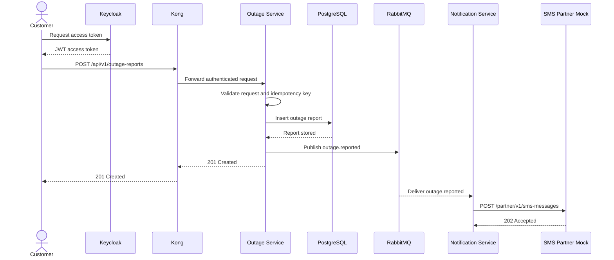
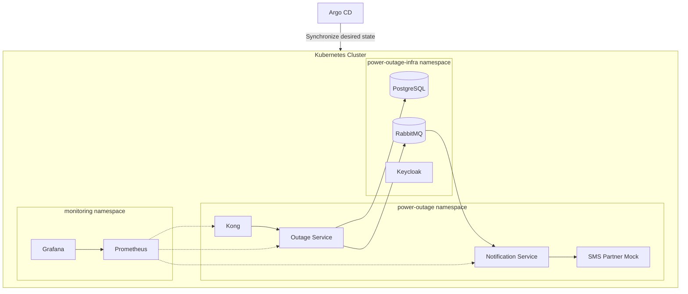

# Architecture

## 1. Purpose

This document describes the architecture of the Power Outage Reporting System. The system implements one business function: accepting a power outage report and sending a simulated SMS confirmation.

The project uses test data only and does not connect to real EVN systems.

## 2. System Context

### External actors and systems

| Actor or system | Responsibility |
|---|---|
| Customer | Submits a power outage report. |
| Operator | May submit a report on behalf of a customer. |
| Keycloak | Authenticates users and issues JWT access tokens. |
| SMS Partner Mock | Simulates an external SMS gateway. |

## 3. Container View

## 4. Component Responsibilities

### Kong API Gateway

- Exposes the public API endpoint.
- Routes requests to the Outage Service.
- Adds or forwards the correlation identifier.
- Applies rate limiting and request-size limits.
- Exposes gateway metrics to Prometheus.

### Outage Service

- Validates the outage report request.
- Validates the JWT and required user role.
- Enforces idempotency using the `Idempotency-Key` header.
- Stores the outage report in PostgreSQL.
- Returns `201 Created` to the client.
- Publishes an `outage.reported` event to RabbitMQ.

### PostgreSQL

- Stores outage reports.
- Stores idempotency keys to prevent duplicate reports.
- Is owned logically by the Outage Service.

### RabbitMQ

- Provides asynchronous communication between the Outage Service and Notification Service.
- Routes the `outage.reported` event to the notification queue.
- Moves messages to a dead-letter queue after the retry limit is reached.

### Notification Service

- Consumes `outage.reported` events.
- Prevents duplicate event processing.
- Calls the SMS Partner Mock through REST.
- Applies timeout and retry rules.
- Records notification success or failure in logs and metrics.

### SMS Partner Mock

- Simulates an external partner API.
- Supports success, timeout, and server-error scenarios.
- Returns a simulated SMS message identifier.

### Keycloak

- Authenticates users.
- Issues JWT access tokens.
- Provides the `CUSTOMER`, `OPERATOR`, and `ADMIN` roles.

## 5. Main Processing Sequence

## 6. Communication Patterns

| Source | Destination | Protocol | Pattern | Purpose |
|---|---|---|---|---|
| Client | Kong | HTTPS/REST | Synchronous | Submit an outage report. |
| Kong | Outage Service | HTTP/REST | Synchronous | Route the API request. |
| Outage Service | PostgreSQL | TCP/SQL | Synchronous | Store the report. |
| Outage Service | RabbitMQ | AMQP | Asynchronous | Publish the outage event. |
| RabbitMQ | Notification Service | AMQP | Asynchronous | Deliver the outage event. |
| Notification Service | SMS Partner Mock | HTTP/REST | Synchronous | Request an SMS notification. |

## 7. Deployment View

The first implementation will run locally before Kubernetes is introduced. Kubernetes and Argo CD are later project milestones.

## 8. Security Boundaries

- Public clients can access the application only through Kong.
- Keycloak issues tokens; application services validate them.
- PostgreSQL and RabbitMQ are not publicly exposed.
- Only the Notification Service calls the SMS Partner Mock.
- Passwords and keys are supplied through environment variables or Kubernetes Secrets.

## 9. Observability

- All services expose health and Prometheus metrics through Spring Boot Actuator.
- Kong exposes gateway request metrics.
- Logs include the service name and correlation identifier.
- Grafana displays request rate, error rate, latency, outage report count, and notification results.

## 10. Key Design Decisions

| Decision | Reason |
|---|---|
| Keep one business workflow | Makes the project suitable for a beginner and a short final-course demonstration. |
| Use RabbitMQ | Lightweight and suitable for event delivery, retry, and dead-letter queues. |
| Use an SMS partner mock | Demonstrates partner integration without requiring a real external account. |
| Validate JWT in the service | Works with Kong OSS and clearly separates gateway and identity responsibilities. |
| Use an idempotency key | Prevents duplicate reports when a client retries a request. |
| Build locally before Kubernetes | Allows each application function to be tested before platform complexity is added. |

## 11. Out of Scope

- Real EVN customer and grid data.
- Real SMS delivery.
- Incident dispatch and repair workflows.
- SCADA, GIS, OMS, or CMIS integration.
- A frontend web or mobile application.
